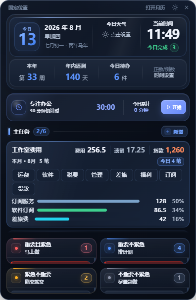
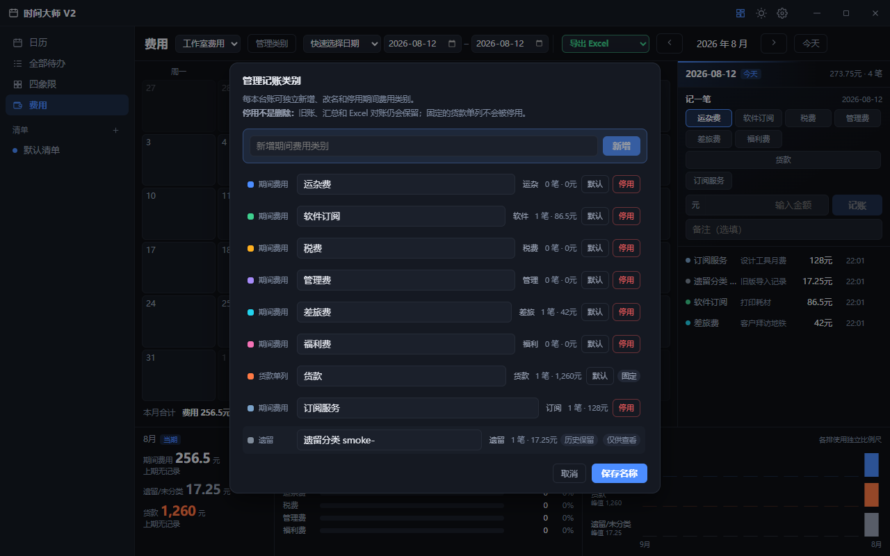
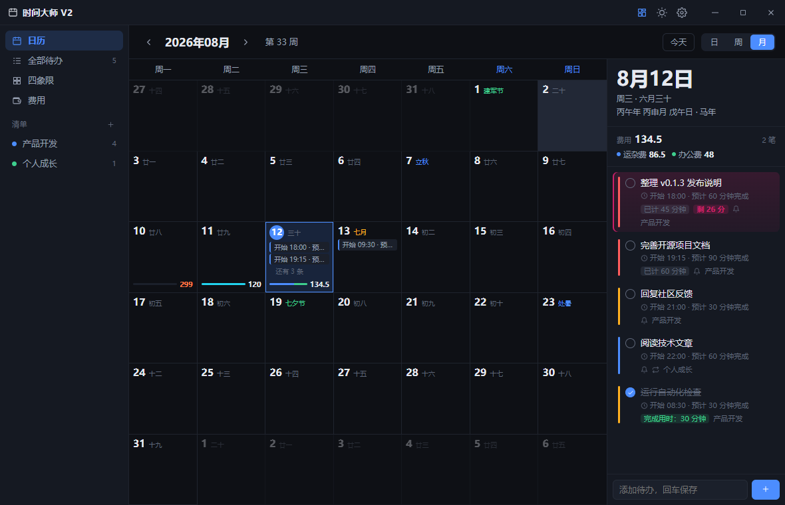
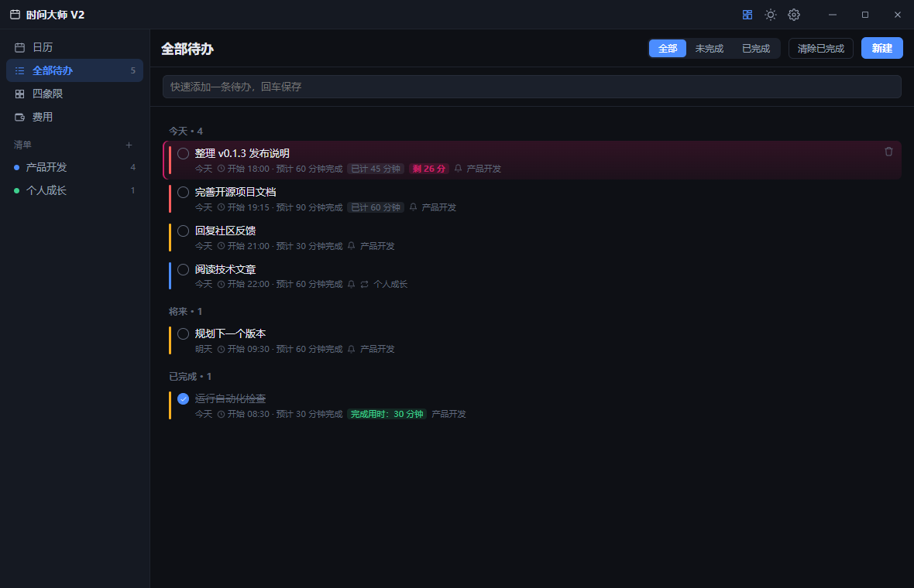
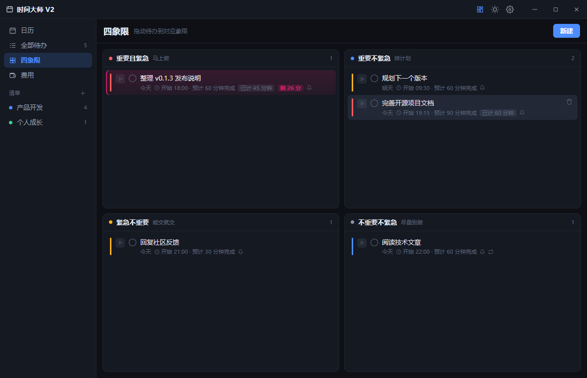
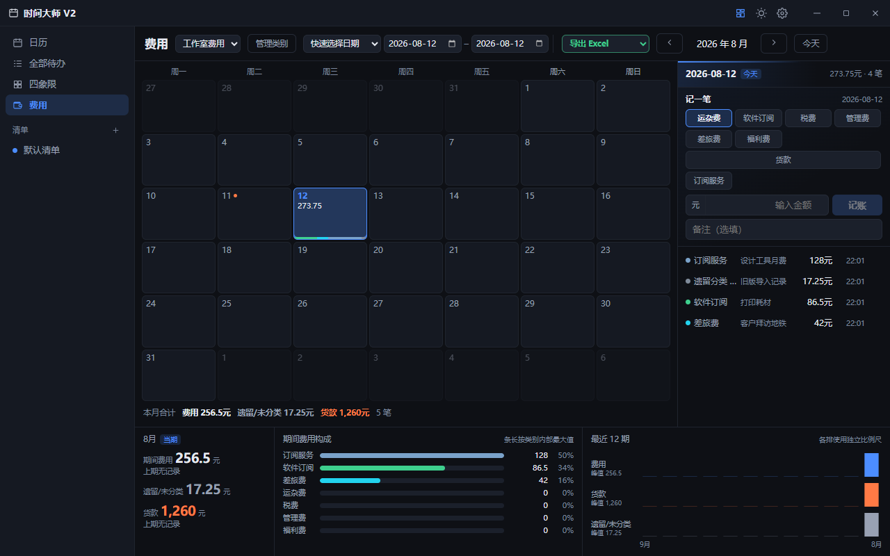

# 时间大师 V2（TimeMaster V2）

[](LICENSE)
[](https://github.com/bigelephant-code/TimeMasterV2/actions/workflows/validate.yml)
[](https://github.com/bigelephant-code/TimeMasterV2/actions/workflows/codeql.yml)
[](https://github.com/bigelephant-code/TimeMasterV2/releases)

[English](README.en.md) | 简体中文

时间大师 V2 是一个面向 Windows 的本地优先时间管理工具，把日历、待办、艾森豪威尔四象限、专注计时、主任务、费用台账和桌面小组件放在同一个工作台中。

它适合希望在一个无需账号、默认不上传个人任务数据的 Windows 工作区中，同时看清“今天做什么、先做什么、投入了多久、长期目标进度和项目支出”的用户。

<p align="center">
  
</p>
<p align="center"><sub>桌面小组件集中展示日期、专注、主任务、费用与四象限；截图使用虚构演示数据。</sub></p>

[](https://github.com/bigelephant-code/TimeMasterV2/releases/latest)

> **版本与来源：** `v0.1.3` 保留项目所有者制作的原始、未签名 Windows 安装包。当前 `0.1.6` Windows x64 版本沿用从 0.1.3 产物重建的可编辑、可构建 **source-equivalent reconstruction**；它不是丢失的原始 Vue 源码，也不保证与 0.1.3 逐字节一致。安装包未经过 Authenticode 签名，实际下载内容与 SHA-256 以 [GitHub Releases](https://github.com/bigelephant-code/TimeMasterV2/releases) 附件为准。详见 [恢复记录](docs/RECOVERY.md)。

## 功能概览

| 模块 | 能力 |
|---|---|
| 日历 | 月、周、日视图；公历、农历、节气、传统节日和法定节假日 |
| 待办 | 多清单、起止时间、优先级、重复、提醒、拖拽和耗时统计 |
| 四象限 | 与待办共用数据，在重要/紧急四个象限之间整理任务 |
| 专注办公 | 自定义倒计时、暂停/继续、完成记录和每日汇总 |
| 主任务 | 目标进度、周期累计和历史记录 |
| 费用台账 | 按日期记账、历史明细、补录识别和 Excel 对账导出 |
| 桌面小组件 | 日期、农历、天气、时间节点、专注、主任务和今日四象限 |
| 本地数据 | JSON 原子写入、损坏文件留档、自动备份与恢复 |

### 0.1.6 正式版（2026-08-13）

- 修复桌面小组件费用快捷记账无法通过点击空白处取消的问题。
- 现在也可按 `Esc` 收起输入区；取消不会写入账目，并会清空未提交草稿。

### 0.1.5 正式版（2026-08-13）

- 全面重做主窗口、侧栏、日历、全部待办、四象限、设置及编辑弹窗的视觉层级，同时保留费用页的信息密度。
- “编辑费用分类”现在紧邻“记一笔”的实际分类按钮，明确支持新增、修改名称、删除和恢复。
- 删除分类只会从新记账按钮中移除该项；历史账目、汇总和 Excel 对账继续保留稳定归属。
- 打包应用视觉烟测扩展到九个界面与窗口状态。

### 0.1.4 正式版（2026-08-12）

> 以下能力属于 `0.1.4` Windows x64 正式版，不包含在原始 `0.1.3` 安装包中。0.1.4 安装包未签名，Windows 可能显示 SmartScreen 提示；本段描述版本内容，不代表安装包已经上传到 GitHub Release。

- 每本费用台账可以独立新增、重命名、停用和恢复期间费用类别；“货款”单列仍保持固定口径。
- 类别使用稳定编号关联流水。重命名或停用不会改写、移动或删除既有费用记录；停用类别仍保留在历史、汇总和 Excel 导出中。
- 从 0.1.3 升级时，现有类别和自定义名称会从数据模型 v3 迁移到 v4，费用金额、日期、备注和类别编号保持不变。
- Excel 对账按稳定类别编号和实际类别数量动态生成分类汇总与核对公式，类别改名不会改变历史金额归属。

<p align="center">
  
</p>
<p align="center"><sub>0.1.5 分类按钮管理实机验收图；来自隔离环境，内容均为虚构数据。</sub></p>

## 界面预览

| 日历 | 待办 |
|---|---|
|  |  |
| 四象限 | 费用台账 |
|  |  |

包括首屏小组件在内的所有截图均来自隔离演示环境；任务名称、金额、日期和其他内容均为虚构脱敏数据，不代表真实用户或真实采用情况。

## 隐私、安全与支持

- 待办、专注记录、主任务、费用台账和设置默认保存在本机 `%APPDATA%\timemaster-v2\`。
- 应用没有账号体系、广告、会员、分析或遥测上报。天气仍是 0.1.3—0.1.6 正式版中唯一有意联网的功能；启用后会向 Open-Meteo 发送城市搜索文本或经过取整的经纬度。费用分类管理和界面改版不增加联网目的地或第三方数据共享。
- 主窗口和小组件启用 Electron renderer sandbox 与 `contextIsolation`、关闭 Node 集成，并通过显式 preload/IPC 白名单访问原生能力。
- 详细数据流、删除方式和联网边界见 [隐私说明](PRIVACY.md)；安全假设与剩余风险见 [威胁模型](docs/THREAT_MODEL.md)；使用帮助见 [支持说明](SUPPORT.md)；漏洞请按 [安全政策](SECURITY.md) 私下报告。
- 默认分支由 Windows CI 和 CodeQL 自动检查；Dependabot 每月检查 npm 与 GitHub Actions 更新。自动检查不能替代人工审查，也不构成安全保证。

这是一款本地优先软件，不代表数据天然安全：应用数据和导出的工作簿未由 TimeMaster V2 加密，本机恶意软件或具有同等用户权限的进程仍可能读取它们。

## 安装包完整性

`0.1.6` 的正式产物为 Windows x64 NSIS 安装包 `TimeMasterV2-Setup-0.1.6.exe`，**未经过 Authenticode 签名**。请只使用可信来源提供的实际安装包，并核对与该产物一同发布的 SHA-256；本 README 不以版本文字代替实际文件哈希，也不表示安装包已经上传到 GitHub Release。

原始 0.1.3 产物继续作为恢复来源和不可变参考保留。其文件名与 SHA-256 如下：

原始 `TimeMasterV2-Setup-0.1.3.exe` 的 SHA-256：

```text
8EEF4DB7BDF2F8BA4911C97E9189232DA9D7D362034822E51A6D03DB333DE9E4
```

0.1.3 安装包也 **未经过 Authenticode 签名**。只应从本仓库的 [GitHub Releases](https://github.com/bigelephant-code/TimeMasterV2/releases) 下载，并在运行前与 Release 中的校验文件核对：

```powershell
Get-FileHash .\TimeMasterV2-Setup-0.1.3.exe -Algorithm SHA256
```

哈希一致只能确认文件与发布产物相同，不能替代代码签名，也不能保证程序绝对安全。完整的产物来源和恢复限制见 [恢复记录](docs/RECOVERY.md)。

## 从源码运行与验证

要求：Windows 10/11、Node.js 22.12 或更高版本。

```powershell
git clone https://github.com/bigelephant-code/TimeMasterV2.git
Set-Location TimeMasterV2
npm ci
npm run check
npm start
```

`npm run check` 会验证不可变的 0.1.3 参考运行时、执行 IPC/安全契约测试、构建当前 `src/`，并检查生成的 `out/`。它验证工程完整性和关键契约，不表示构建与原始 0.1.3 安装包逐字节相同。

如果 npm 没有下载锁定版本的 Electron 运行时，可执行：

```powershell
npm run ensure:electron
```

构建 Windows x64 NSIS 安装包：

```powershell
npm run dist
```

新产物写入 `release/`。每个正式产物使用独立版本号和文件名，不应覆盖或冒充原始 `v0.1.3` 产物。

验证完整目录包的主窗口、小组件、sandboxed preload 和 IPC：

```powershell
npm run dist:dir
npm run smoke:packaged
```

smoke test 使用显式隔离的临时 `userData` 与 session 目录，不读取或修改正式 `%APPDATA%\timemaster-v2\`。

## 目录与版本边界

```text
src/                       0.1.6 的可编辑、可构建 source-equivalent 输入
runtime/                   从原始 0.1.3 app.asar 提取的不可变黄金参考
legacy/litecal-0.1.0/      历史 LiteCal 0.1.0 模块化源码，仅作迁移参考
tests/                     IPC 与安全契约测试
scripts/                   参考哈希、构建与产物验证工具
docs/                      架构、威胁模型和恢复资料
```

原始安装包没有携带 source map 或原始 Vue 单文件组件，因此无法逐字节恢复丢失的工程结构。当前 `src/` 可审查、编辑和构建，但部分模块边界及 Vue 模板结构仍需要渐进式重构。详见 [架构说明](docs/ARCHITECTURE.md)、[恢复记录](docs/RECOVERY.md) 和 [Roadmap](ROADMAP.md)。

## 参与贡献

欢迎提交真实问题、功能建议和 Pull Request。开始前请阅读 [贡献指南](CONTRIBUTING.md)。请勿在 Issue、日志或截图中上传真实任务、费用、精确位置、令牌或本机绝对路径。

项目以 [MIT License](LICENSE) 发布。直接运行时依赖及完整许可证文本见 [THIRD_PARTY_NOTICES.md](THIRD_PARTY_NOTICES.md)。
